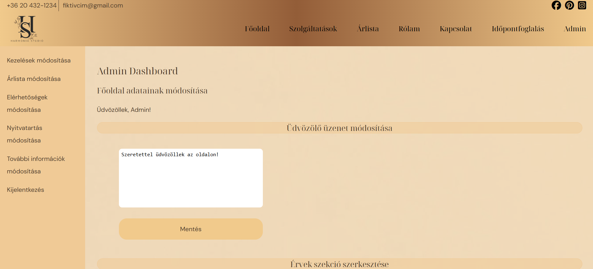

# Harmónia Stúdió – Adminisztrációs rendszer rövid ismertetés

Ez a projekt egy fiktív kozmetikai stúdió adminisztrációs felületét tartalmazza, ahol az adminisztrátor szerkesztheti a főoldal tartalmait, hozzáadhat kezeléseket és módosíthatja az információkat.

---

## Információk a letöltéshez, megnyitáshoz

Másold a `exam_project` mappát a `C:\xampp\htdocs\` könyvtárba.
A végleges elérési út: `C:\xampp\htdocs\exam_project\`

---

## Az adatbázis beállítása

1. Indítsd el a **XAMPP Control Panel** programot.  
2. Kattints az **Apache** és **MySQL** `Start` gombjára.
3. Nyisd meg **phpMyAdmin**-t a böngészőben: [phpMyAdmin](http://localhost/phpmyadmin/)  
4. Hozz létre egy új adatbázist exam_project néven.  
5. Importáld a mellékelt **`exam_project.sql`** fájlt az adatbázisba.

---

## Weboldalak elérése

- [Főoldal megnyitása:](http://localhost/exam_project/)
- [Admin bejelentkezés:](http://localhost/exam_project/login_system/login.php)

---

## Bejelentkezési adatok:

- **Felhasználónév**: admin@example.com 
- **Jelszó**: Admin!123

---

## Könyvtárstruktúra

exam_project/ 
│── admin/ # Admin felület 
│── assets/ # Képek, Stílusok (A projekt SASS (.scss) fájlokat használ a stílusok kezelésére.) 
│── config/ # Adatbázis és segédfüggvények 
│── constans/ # Fájl elérési útvonalak
│── controllers/ # Kérések kezelése 
│── includes/ # Fejléc, lábléc, navigáció
│── login_system/ # Bejelentkezés és hitelesítés, kijelentkezés
│── pages/ # További oldalak (kezelések, süti kezelés, árlista, időpontfoglalás) 
│── scripts/ # Dinamikus oldalak (jQuery)
│── exam_project.sql # Adatbázis fájl
│── index.php # Főoldal
│── logo.ico # Az oldal logoja
│── README.md # Dokumentáció

---

## Rendszerkövetelmények

PHP verzió: PHP 8.2.12 
Webszerver: Apache (XAMPP 8.2.12)
Adatbázis: MariaDB/MySQL