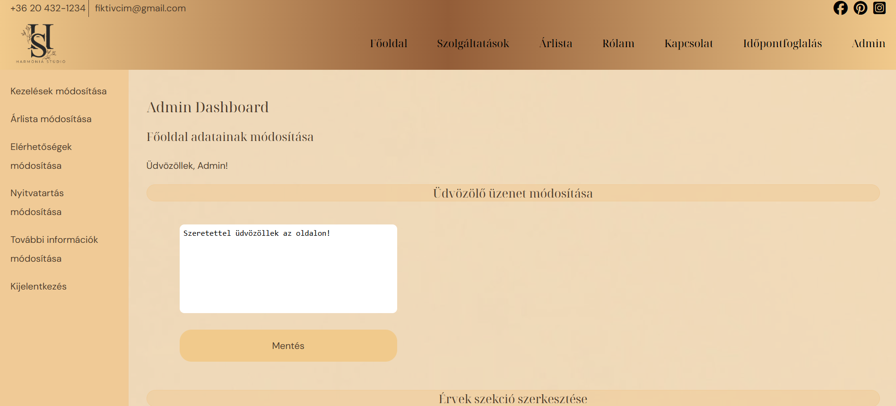

<p align="right">
  🌐 <a href="README_EN.md">English version</a>
</p>

# Harmónia Stúdió – Adminisztrációs rendszer

**Nyelv:** HU Magyar | [GB English](README_EN.md)



Ez a projekt a **Harmónia Stúdió fiktív kozmetikai szalonjának admin felületét** mutatja be, amely a **Full Stack Webfejlesztő képzés** első moduljának (HTML+CSS(+JS alapok) front-end webfejlesztő tanfolyam) végén készített **bemutató weboldalam folytatásaként** készült a második modul (PHP programozás + MySQL adatbázis képzés) záró projektjeként.

---

## Leírás

A projekt célja egy **modern, karbantartható és biztonságos adminisztrációs felület** létrehozása, amely:
- **Adatbázisban tárolja** a szolgáltatásokat és főoldali szakaszokat, kezelési kategóriákat, admin felhasználókat.
- **Admin felület** lehetőséget ad **adatok hozzáadására, módosítására és törlésére (CRUD).**
- **Bejelentkezés** jelszóhasheléssel (password_hash/password_verify) és lejáró session-ökkel.
- **JavaScript visszaszámláló** a session lejárat kezelésére és interaktív frissítésére.
- **Moduláris függvény-orientált szerkezet**, áttekinthető könyvtár struktúrával.
- **Clean URL & Routing** `.htaccess` + Front Controller mintázat a tiszta elérési utakért (pl. `/login`, `/admin`).
- **Reszponzív Design:** SASS alapú, Mobile-First megközelítésű felület.

---

## Könyvtárstruktúra

```text
cosmetic_website_v2/ 
│   README.md
│   README_EN.md
│
├───app/                             # Backend logika (nem publikus)
│   │   .env                         # Érzékeny adatok (NEM része a repónak)
│   │   .env.local
│   │   cosmetic_website_v2.sql      # Adatbázis
│   │
│   ├───admin/                       # Admin Dashboard: Központi felület a tartalom kezeléséhez (CRUD műveletek megjelenítése)
│   │
│   ├───config/                      # Adatbázis segédfüggvények, DB csatlakozás, SQL lekérdezések, biztonsági szűrők
│   │
│   ├───constans/                    # Fájl elérési útvonalak
│   │
│   ├───controllers/                 # Központi kéréskezelő, validáció és CRUD logika
│   │
│   ├───includes/                    # Újrafelhasználható modulok (header, footer, nav)                  
│   │
│   └───login_system/                # Hitelesítés és kijelentkeztetés
│
└───public/
    │   .htaccess                    # URL átírási szabályok az index.php-re irányításhoz
    │   index.php                    # Belépési pont (Front Controller): URL routing, session- és függőségkezelés
    │   logo.ico                     # Az oldal ikonja (favicon)
    │   
    ├───assets/
    │   ├───images/
    │   │
    │   ├───scripts/
    │   │       scripts.js           # Kliensoldali logika: interakciók, validációk és UI animációk
    │   │
    │   └───styles/ # Stílusok kezelése
    │           _*.scss              # SASS partials (változók, mixinek, reset)
    │           *.scss               # Oldalspecifikus SASS forrásfájlok
    │           *.css                # Lefordított, böngésző kész stíluslapok
    │
    └───pages/ 
            404.php
            body-treatment.php
            booking.php
            cookie-policy.php
            facial-treatment.php
            hair-removal.php
            home.php
            make-up.php
            price-list.php
```

---

## Adatbázis

### Táblák:
1. login_data - admin felhasználók (email, jelszó hash, utolsó ellenőrzés)
2. home_page_section - főoldali szakaszok (cím, tartalom)
3. highlighted_treatment - kiemelt kezelések
4. treatment_categories - kezelések kategóriái
5. argument - főoldal egyéb tartalma

Kapcsolatok: a kiemelt kezelések és a kategóriák egy-a-sokhoz relációval kapcsolódnak a főoldali szakaszon.

---

## Információk a letöltéshez, megnyitáshoz

1. Másolás: Helyezd a cosmetic_website_v2 mappát a C:\xampp\htdocs\ könyvtárba.

2. Virtual Host beállítása (Ajánlott):
A C:\xampp\apache\conf\extra\httpd-vhosts.conf fájlhoz add hozzá az alábbiakat:

```text
<VirtualHost *:80>
    DocumentRoot "C:/xampp/htdocs/cosmetic_website_v2/public"
    ServerName localhost
</VirtualHost>
```
3. Adatbázis: Importáld a cosmetic_website_v2.sql fájlt a phpMyAdmin-ban.

4. Környezeti változók: Az app/.env.local fájlban add meg a saját adatbázis-hozzáférésedet.

---

## Az adatbázis beállítása

1. Indítsd el a **XAMPP Control Panel** programot.  
2. Kattints az **Apache** és **MySQL** `Start` gombjára.
3. Nyisd meg **phpMyAdmin**-t a böngészőben: [phpMyAdmin](http://localhost/phpmyadmin/)  
4. Hozz létre egy új adatbázist cosmetic_website_v2 néven.  
5. Importáld a mellékelt **`cosmetic_website_v2.sql`** fájlt az adatbázisba.

---

## Weboldalak elérése

A projekt élőben is megtekinthető az alábbi linken: harmoniastudio.zita.dev

- [Főoldal megnyitása:](http://localhost/)
- [Admin bejelentkezés:](http://localhost/login)

---

## Bejelentkezési adatok:

- **Felhasználónév**: admin@example.com 
- **Jelszó**: Admin!123

---

## Használt technológiák

- **PHP 8.x** - backend logika, session kezelés, függvény-orientált szemlélet
- **MySQL/MariaDB** - adatbázis a tároláshoz
- **JavaScript** - session visszaszámláló, interaktív funkciók
- **HTML5 / CSS3 / SASS** - reszponzív, szematikailag helyes frontend
- **Font Awesome + Google Fonts** - esztétikus megjelenés

---

## Rendszerkövetelmények

PHP verzió: PHP 8.2.12 
Webszerver: Apache (XAMPP 8.2.12)
Adatbázis: MariaDB/MySQL

---

## Készítette
Név: Lukács Zita
Dátum: 2025. február
Modul: PHP programozás + MySQL adatbázis 